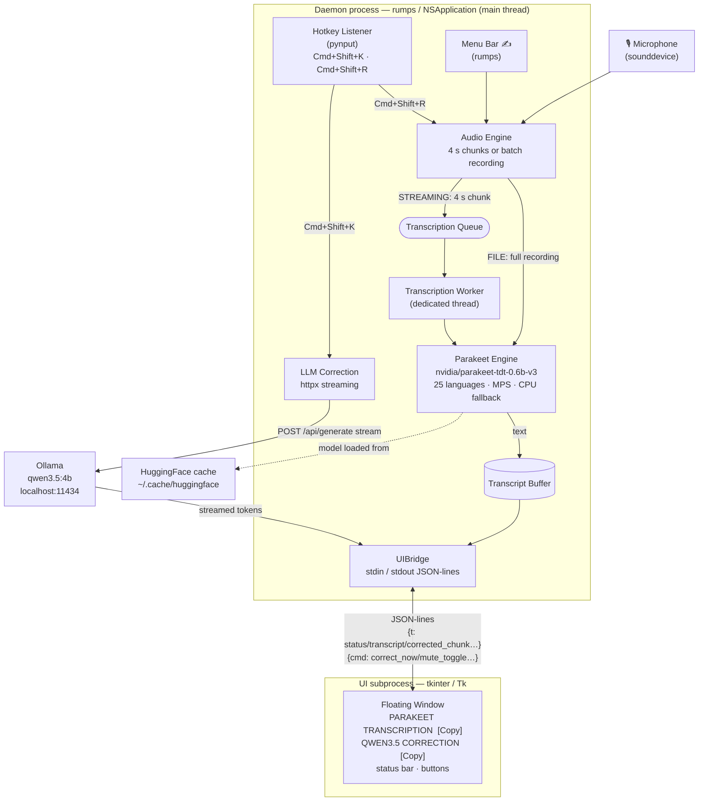

# Dictation Corrector v2

Real-time dictation correction for bilingual (French/English) authors on macOS.
Captures microphone audio, transcribes with **Parakeet TDT v3** (25 languages), then corrects ASR errors with **Qwen3.5:4b** via Ollama — all in a persistent floating window.

---

## Architecture



### Data flow summary

| Step | Component | Detail |
|------|-----------|--------|
| 1 | Audio Engine | Captures mic at 16 kHz, accumulates 4 s chunks (STREAMING) or full recording (FILE) |
| 2 | Parakeet Engine | Writes chunk to temp WAV, calls `model.transcribe()` on MPS/CPU |
| 3 | Transcript Buffer | Appends new text, sends `{t: transcript}` to UI |
| 4 | LLM Correction | POSTs buffer to Ollama, streams response tokens back to UI |
| 5 | UI subprocess | Displays raw ASR text and corrected text side by side |

---

## Dependencies

| Package | Role |
|---------|------|
| `nemo_toolkit[asr]` | Parakeet ASR model |
| `torch` / `torchaudio` | Inference backend (MPS on Apple Silicon) |
| `sounddevice` + `soundfile` | Mic capture and WAV I/O |
| `librosa` | Audio file loading and resampling (import mode) |
| `httpx` | Streaming HTTP to Ollama |
| `pynput` | Global keyboard shortcuts |
| `rumps` | macOS menu bar app |
| `pyperclip` | Copy-to-clipboard |
| [Ollama](https://ollama.com) | Local LLM server |

---

## Installation

```bash
# 1. Python 3.11+  (Anaconda recommended on macOS)
python3 --version

# 2. Python packages
pip install nemo_toolkit[asr] sounddevice soundfile numpy httpx pynput rumps pyperclip librosa

# 3. Ollama + model
brew install ollama
ollama pull qwen3.5:4b

# 4. ffmpeg — required for MP3 / M4A import
brew install ffmpeg

# 5. Microphone permission
# System Settings → Privacy & Security → Microphone → allow Terminal

# 6. Accessibility permission (for global hotkeys)
# System Settings → Privacy & Security → Accessibility → allow Terminal
```

> The Parakeet model (~600 MB) is downloaded automatically from HuggingFace on first run.

---

## Usage

```bash
python dictation_corrector.py
```

An environment check runs first (Python version, packages, PyTorch/MPS, Parakeet cache, microphone, Ollama). If all prerequisites pass, the menu bar icon `✍️` and the floating window appear. **The microphone starts muted** — click 🔇 to activate.

### Keyboard shortcuts

| Shortcut | Action |
|----------|--------|
| `Cmd+Shift+K` | Correct current transcript buffer with Qwen3.5 |
| `Cmd+Shift+R` | Start / stop recording (FILE mode only) |

### Window buttons

| Button | Action |
|--------|--------|
| Mode (STREAMING / FILE) | Toggle audio capture mode |
| Correct now | Trigger LLM correction immediately |
| 🎙 Active / 🔇 Muted | Toggle microphone |
| Copy *(per panel)* | Copy Parakeet or Qwen text to clipboard |
| Clear | Clear both transcript and correction buffers |
| Import… | Open a WAV / MP3 / M4A / FLAC / OGG file, transcribe and correct it |
| Quit | Clean shutdown |

---

## Audio modes

**STREAMING** — continuous capture, transcribed every 4 s, correction triggered manually (`Cmd+Shift+K` or button).

**FILE** — press `Cmd+Shift+R` to start, press again to stop; the full recording is transcribed as a single batch and corrected automatically.

**Import** — click `Import…` to open an existing audio file (WAV, MP3, M4A, FLAC, OGG). The file is loaded via librosa, resampled to 16 kHz mono, then split into silence-aware chunks (~90 s target, cuts at the last natural pause within the final 15 s). Each chunk is transcribed by **Parakeet v3** (25 languages, automatic language detection) then corrected by Qwen3.5. Requires `brew install ffmpeg` for non-WAV formats.

---

## Correction prompt

Qwen3.5 is instructed to fix **only** (and only when confidence > 95%):
1. Words manifestly phonetized by the ASR (e.g. `"baguette"` → `"backlog"`)
2. Obvious phonetic transcription errors in the current language
3. Orally dictated punctuation (`"virgule"` → `,`, `"point"` → `.`)

It **never** translates between languages, adds words absent from the source, or reformulates content.
